## __AUTOMATING INFRASTRUCTURE USING TERRAFORM__

In this project, I will be automating the  __AWS infrastructure for 2 websites__ that I manually created in [Project-15](https://github.com/dybran/Project-15/blob/main/Project-15.md) using __Terraform__.

__AWS MULTIPLE WEBSITE ARCHITECTURE__

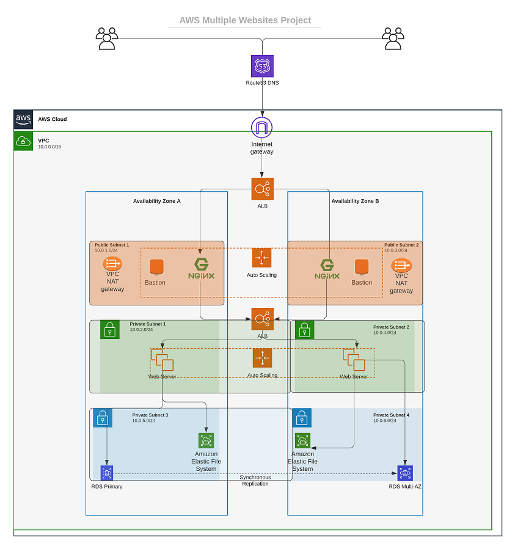

__Prerequisites:__

- AWS account;
- AWS Identify and Access Management (IAM) credentials and programmatic access.
- Set up AWS credentials locally with `aws configure` in the __AWS Command Line Interface (CLI).__ Click [here](https://github.com/dybran/AWS-Lift-and-Shift-Project/blob/main/AWS-Lift-and-Shift-Project.md)

To write quality Terraform codes, we need to:

- Understand the goal of the desired infrastructure.
- Ability to effectively use up to date Terraform documentation. Click [here](https://registry.terraform.io/)

The resources to be created include:

- S3 buket
- A VPC
- 2 Public subnets

  

__CREATE S3 BUCKET__

Create an S3 bucket to store Terraform state file

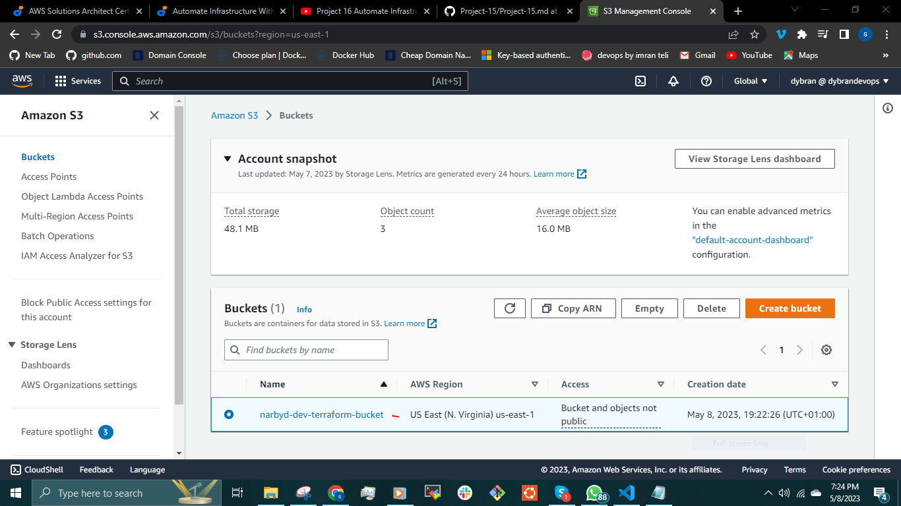

From my terminal, I should be able to see the S3 bucket i just created if my __aws CLI__ is configured. Run the command

`$ aws s3 ls`


__CREATING VPC | SUBNETS | SECURITY GROUPS__

Create a directory structure.

In VS Code, Create a folder called __PBL__ and create a file in the folder, name it __main.tf__

Install the following Terraform extensions on Vs Code

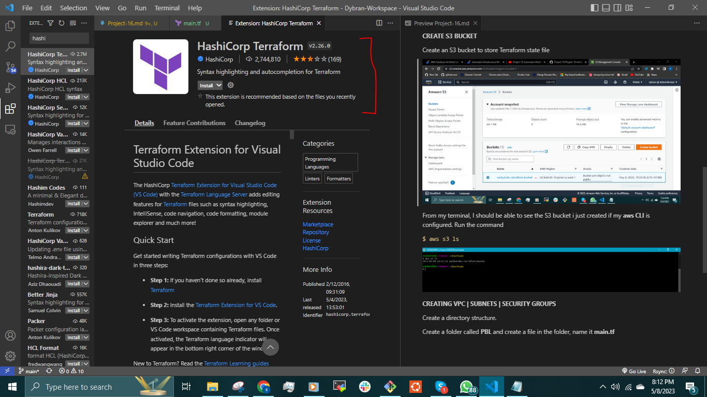


__Provider and VPC resource section__

Add AWS as a provider, and a resource to create a VPC in the __main.tf__ file. The provider block informs Terraform that we intend to build infrastructure within AWS while the __resource__ block will create a VPC.

Go to [Terraform documentation](https://registry.terraform.io/), select the provider and go to __documentation__ to access the various resources.

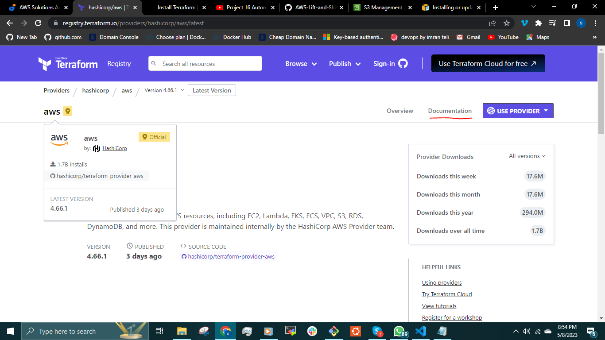

```
provider "aws" {
  region = "us-east-1"
}

# Create VPC
resource "aws_vpc" "narbyd-vpc" {
  cidr_block                     = "172.16.0.0/16"
  enable_dns_support             = "true"
  enable_dns_hostnames           = "true"
  enable_classiclink             = "false"
  enable_classiclink_dns_support = "false"
  tags = {
    Name = "narbyd-VPC"
  }
}
```
Then download the necessary plugins for Terraform to work. These plugins are used by providers and provisioners. At this stage, we only have provider in our __main.tf__ file. So, Terraform will just download plugin for AWS provider.
Run the command 

`terraform init`

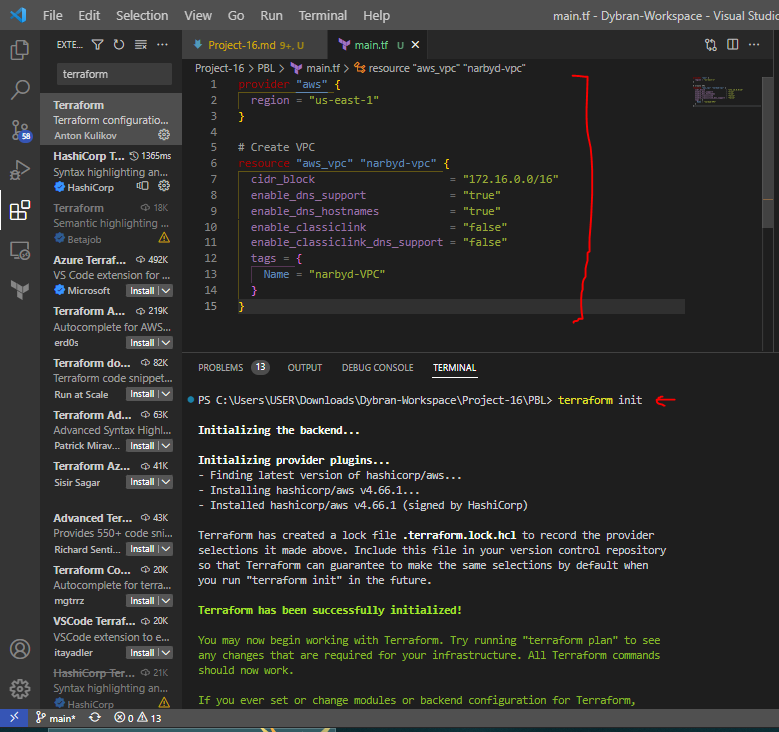

A new file has been created: __.terraform__. This is where Terraform keeps plugins.

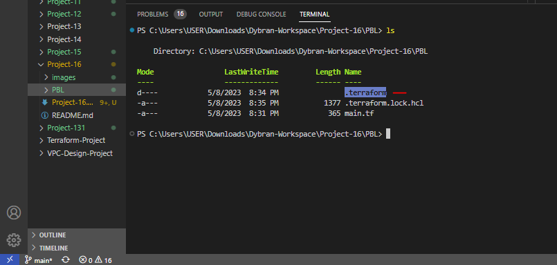

Create the resource we just defined - __aws_vpc__ by running the following commands

`$ terraform validate` - To validate the code

`$ terraform fmt` - To format the code for readability


we should check to see what terraform intends to create before we tell it to go ahead and create it by running the command

`$ terraform plan`

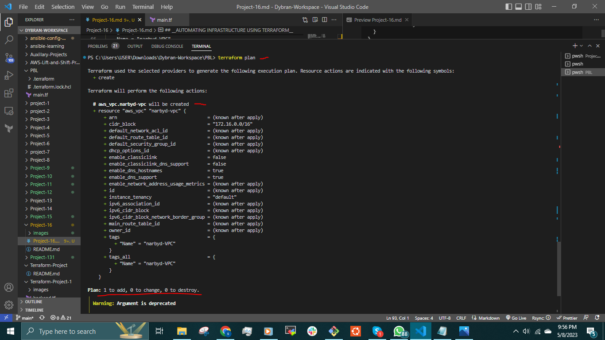

If we are good with the chages planned, run the command

`$ terraform apply`


This creates the VPC - __narbyd-VPC__ and its attributes.

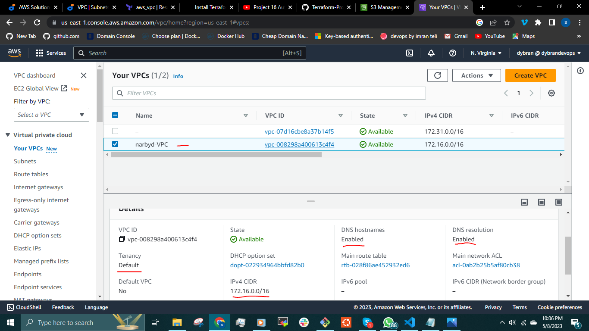

A new file is created __terraform.tfstate__ This is how Terraform keeps itself up to date with the exact state of the infrastructure. It reads this file to know what already exists, what should be added, or destroyed based on the entire terraform code that is being developed.

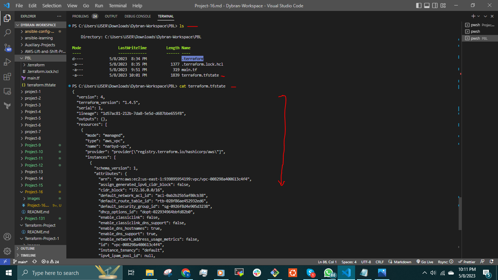

If you also observed closely, you would realise that another file - __terraform.tfstate.lock.info__ gets created during planning and apply but this file gets deleted immediately. This is what Terraform uses to track, who is running its code against the infrastructure at any point in time. This is very important for teams working on the same Terraform repository at the same time. The lock prevents a user from executing Terraform configuration against the same infrastructure when another user is doing the same – it allows to avoid duplicates and conflicts.

__Subnets resource section__

According to our architectural design, we require 6 subnets:

- 2 public
- 2 private for webservers
- 2 private for data layer

Let us create the first 2 public subnets.

Add below configuration to the __main.tf__ file:

```
# Create public subnets1
    resource "aws_subnet" "public1" {
    vpc_id                     = aws_vpc.narbyd-vpc.id
    cidr_block                 = "172.16.1.0/24"
    map_public_ip_on_launch    = true
    availability_zone          = "us-east-1a"
    tags = {
        Name = "narbyd-pub-1"
    }

}

# Create public subnet2
    resource "aws_subnet" "public2" {
    vpc_id                     = aws_vpc.narbyd-vpc.id
    cidr_block                 = "172.16.2.0/24"
    map_public_ip_on_launch    = true
    availability_zone          = "us-east-1a"
     tags = {
        Name = "narbyd-pub-2"
    }
}
```
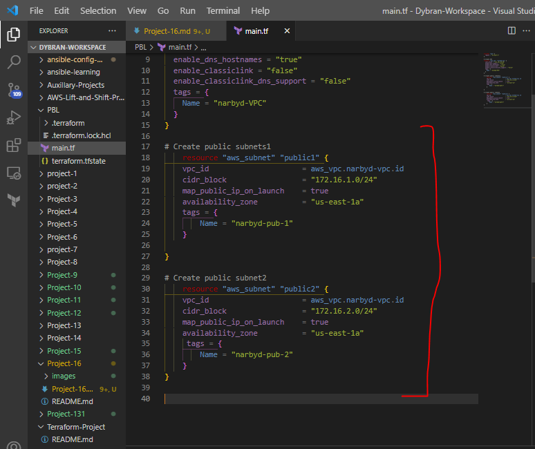

We are creating 2 subnets, therefore declaring 2 resource blocks – one for each of the subnets.
We are using the __vpc_id__ argument to interpolate the value of the VPC id by setting it to __aws_vpc.main.id__. This way, Terraform knows inside which VPC to create the subnet.

Run the commands

`$ terraform validate`

`$ terraform fmt`

`$ terraform plan`

Then

`$ terraform apply` to create the public subnets.

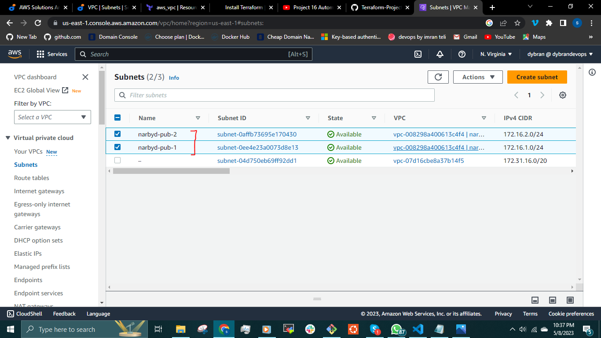

__N/B:__ We should always endeavour to make our work dynamic.
Notice that we have declared multiple resource blocks for each subnet in the code. We need to create a single resource block that can dynamically create resources without specifying multiple blocks. Imagine if we wanted to create 10 subnets, our code would look very clumsy. So, we need to optimize this by introducing a __count__ argument.

Now let us refactor the code.

First we destroy the resources that have been created

`$ terraform destroy`

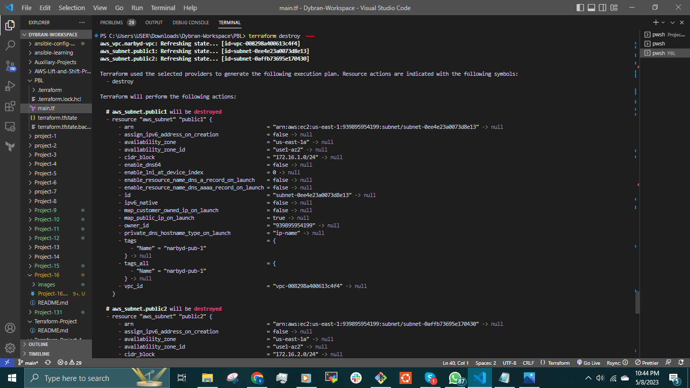
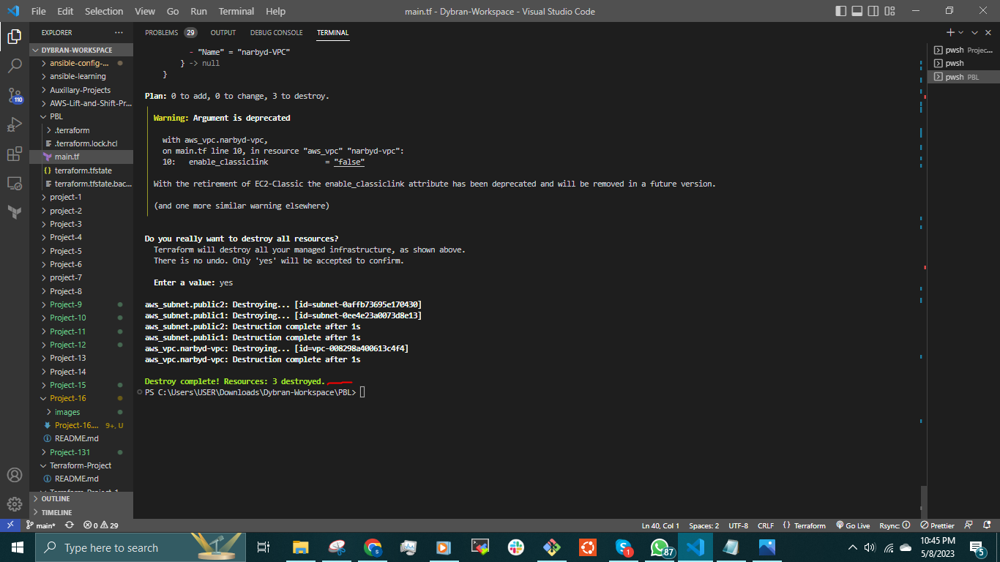

__REFACTORING THE CODE__

We will introduce variables, and remove hard coding. In the provider block, declare a variable named region, give it a default value, and update the provider section by referring to the declared variable.

Create __vars.tf__ and __terraform.tfvars__ files

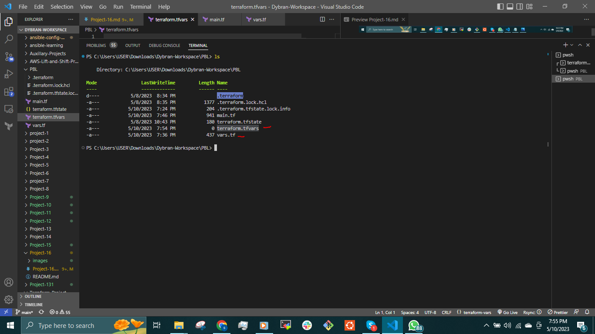

The __vars.tf__  file will contain the variables while the __main.tf__ file will contain the VPC and the provider codes.

Open the __vars.tf__ file and add the following code snippet

```
variable "region" {
    default = "us-east-1"
}

variable "vpc_cidr" {
    default = "172.16.0.0/16"
}

variable "enable_dns_support" {
    default = "true"
}

variable "enable_dns_hostnames" {
    default ="true" 
}

variable "enable_classiclink" {
    default = "false"
}

variable "enable_classiclink_dns_support" {
    default = "false"
}
```


Terraform has a functionality that allows us to pull data which exposes information to us. For example, every region has Availability Zones (AZ). Different regions have from 2 to 4 Availability Zones. With over 20 geographic regions and over 70 AZs served by AWS, it is impossible to keep up with the latest information by hard coding the names of AZs. Hence, we will explore the use of Terraform’s Data Sources to fetch information outside of Terraform. In this case, from AWS.

Let us fetch Availability zones from AWS, and replace the hard coded value in the subnet’s availability_zone section.

Update the __main.tf__ file with the code 

```

# Get list of availability zones
data "aws_availability_zones" "available" {
    state = "available"
}
```


To make use of this new data resource, we will need to introduce a __count__ argument in the subnet block.

```
# Create public subnet1
resource "aws_subnet" "public" {
    count                   = 2
    vpc_id                  = aws_vpc.narbyd-vpc.id
    cidr_block              = "172.16.1.0/24"
    map_public_ip_on_launch = true
    availability_zone       = data.aws_availability_zones.available.names[count.index]

}
```
The count tells us that we need 2 subnets. Therefore, Terraform will invoke a loop to create 2 subnets.
The data resource will return a list object that contains a list of AZs. Internally, Terraform will receive the data like this:

`["us-east-1a", "us-east-1b"]`

Each of them is an index, the first one is index __0__, while the other is index __1__. If the data returned had more than 2 records, then the index numbers would continue to increment. i.e __0, 1, 2, 3 ...__.

Therefore, each time Terraform goes into a loop to create a subnet, it must be created in the retrieved AZ from the list. Each loop will need the index number to determine what AZ the subnet will be created. That is why we refer to __data.aws_availability_zones.available.names[count.index]__ as the value for __availability_zone__. When the first loop runs, the first index will be __0__, therefore the AZ will be __us-east-1a__. The pattern will repeat for the second loop andif there are more records then the loop continues.

If we run Terraform with this configuration, it may succeed for the first time, but by the time it goes into the second loop, it will fail because we still have __cidr_block__ hard coded. The same __cidr_block__ cannot be created twice within the same __VPC__. So, we we need to make __cidr_block__ dynamic.

__Make `cidr_block` dynamic__

We will introduce a function cidrsubnet() to make this happen. It accepts 3 parameters.

```
# Create public subnet1
resource "aws_subnet" "public" { 
    count                   = 2
    vpc_id                  = aws_vpc.narbyd-vpc.id
    cidr_block              = cidrsubnet(var.vpc_cidr, 4 , count.index)
    map_public_ip_on_launch = true
    availability_zone       = data.aws_availability_zones.available.names[count.index]

}
```
 A __cidrsubnet__ function works like an algorithm to dynamically create a subnet CIDR per AZ. Regardless of the number of subnets created, it takes care of the cidr value per subnet.

Its parameters are __cidrsubnet(prefix, newbits, netnum)__

The __prefix__ parameter i.e __var.vpc_cidr__ must be given in CIDR notation, same as for VPC.
The __newbits__ parameter is the number of additional bits with which to extend the prefix. For example, if given a prefix ending with __/16__ and a newbits value of __4__, the resulting subnet address will have length __/20__.
The __netnum__ parameter is a whole number that can be represented as a binary integer with no more than newbits binary digits, which will be used to populate the additional bits added to the prefix.

We can see how this works by entering the terraform console and keep changing the figures to see the output.

On the terminal, run 

`$ terraform console`

type in

`> cidrsubnet("172.16.0.0/16", 4, 0)` 

click __Enter__.

See the output


Keep changing the numbers and see what happens. Then use __exit__ to exit the console.

The next step is to remove the hard coded __count__ value.

__Remove hard coded `count` value.__

Since the data resource returns all the AZs within a region, it makes sense to count the number of AZs returned and pass that number to the count argument.

To do this, we can introuduce __length()__ function, which basically determines the length of a given list, map, or string.

Since __data.aws_availability_zones.available.names__ returns a list like __["us-east-1a", "us-east-1b", "us-east-1c"]__, we can pass it into a lenght function and get number of the AZs.

`> length(["eu-central-1a", "eu-central-1b", "eu-central-1c"])`


Now we can simply update the public subnet block like this

```
# Create public subnet1
resource "aws_subnet" "public" { 
    count                   = length(data.aws_availability_zones.available.names)
    vpc_id                  = aws_vpc.narbyd-vpc.id
    cidr_block              = cidrsubnet(var.vpc_cidr, 4 , count.index)
    map_public_ip_on_launch = true
    availability_zone       = data.aws_availability_zones.available.names[count.index]
}
```
This will create the subnet resource required. But the required number of subnets is __2__ subnets.

To fix this, we declare a variable to store the desired number of public subnets, and set the default value
```
variable "preferred_number_of_public_subnets" {
  default = 2
}
```
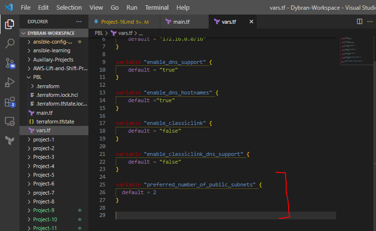

We then update the  __count__ argument with a condition. Terraform needs to check first if there is a desired number of subnets. Otherwise, use the data returned by the lenght function. See how that is presented below.

```
# Create public subnets
resource "aws_subnet" "public" {
  count  = var.preferred_number_of_public_subnets == null ? length(data.aws_availability_zones.available.names) : var.preferred_number_of_public_subnets   
  vpc_id = aws_vpc.narbyd-vpc.id
  cidr_block              = cidrsubnet(var.vpc_cidr, 8 , count.index)
  map_public_ip_on_launch = true
  availability_zone       = data.aws_availability_zones.available.names[count.index]

```

- The __var.preferred_number_of_public_subnets == null__ checks if the value of the variable is set to null or has some value defined.

- The second part __?__ and __length(data.aws_availability_zones.available.names)__ means if preferred number of public subnets is null (Or not known) then set the value to the data returned by lenght function.

- The __:__ and __var.preferred_number_of_public_subnets__ means if the first condition is false, i.e preferred number of public subnets is not null then set the value to whatever is definied in __var.preferred_number_of_public_subnets__.

Open the __terraform.tfvars__ file and set values for each of the variables.

```
region = "us-east-1"

vpc_cidr = "172.16.0.0/16" 

enable_dns_support = "true" 

enable_dns_hostnames = "true"  

enable_classiclink = "false" 

enable_classiclink_dns_support = "false" 

preferred_number_of_public_subnets = 2
```
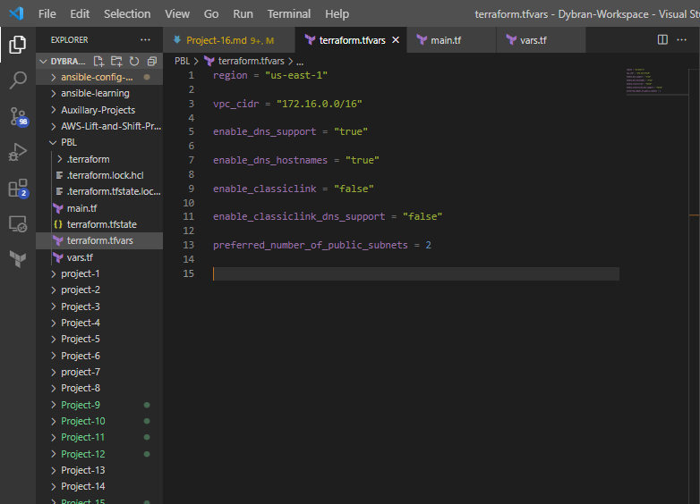

The __main.tf file__ now looks like this

```
provider "aws" {
  region = var.region
}

# Create VPC
resource "aws_vpc" "narbyd-vpc" {
  cidr_block                     = var.vpc_cidr
  enable_dns_support             = var.enable_dns_support 
  enable_dns_hostnames           = var.enable_dns_support
  enable_classiclink             = var.enable_classiclink
  enable_classiclink_dns_support = var.enable_classiclink
  tags = {
    Name = "narbyd-VPC"
  }

}

# Get list of availability zones
data "aws_availability_zones" "available" {
  state = "available"
}


# Create public subnets
resource "aws_subnet" "public" {
  count  = var.preferred_number_of_public_subnets == null ? length(data.aws_availability_zones.available.names) : var.preferred_number_of_public_subnets   
  vpc_id = aws_vpc.narbyd-vpc.id
  cidr_block              = cidrsubnet(var.vpc_cidr, 8 , count.index)
  map_public_ip_on_launch = true
  availability_zone       = data.aws_availability_zones.available.names[count.index]
  tags = {
    Name = "narbyd-pub-sub"
  }

}
```
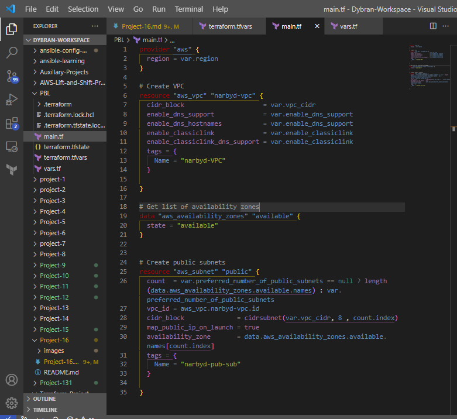

- The __tags__ are used to name the resources

Run 

`terraform init`

`terraform validate`

`terraform fmt`

`terraform plan`

`terraform apply`

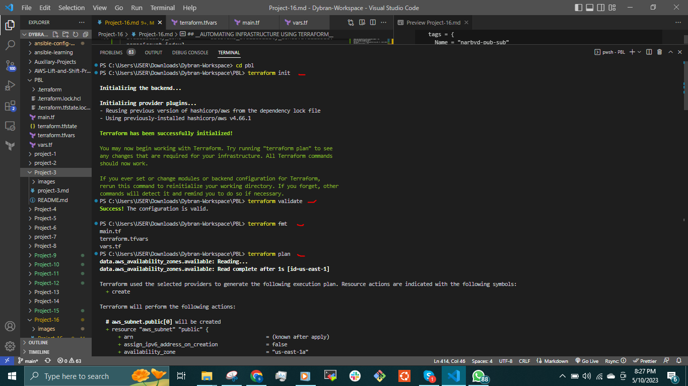
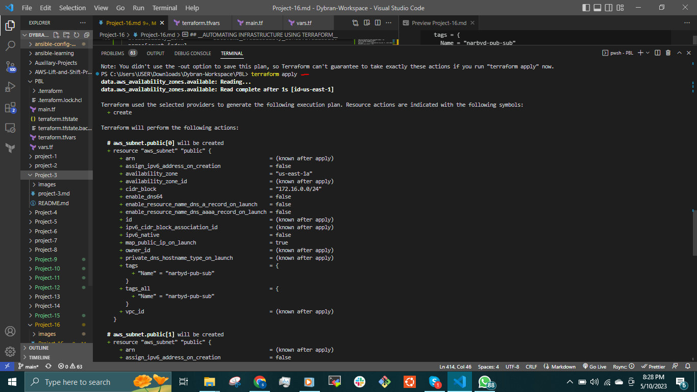
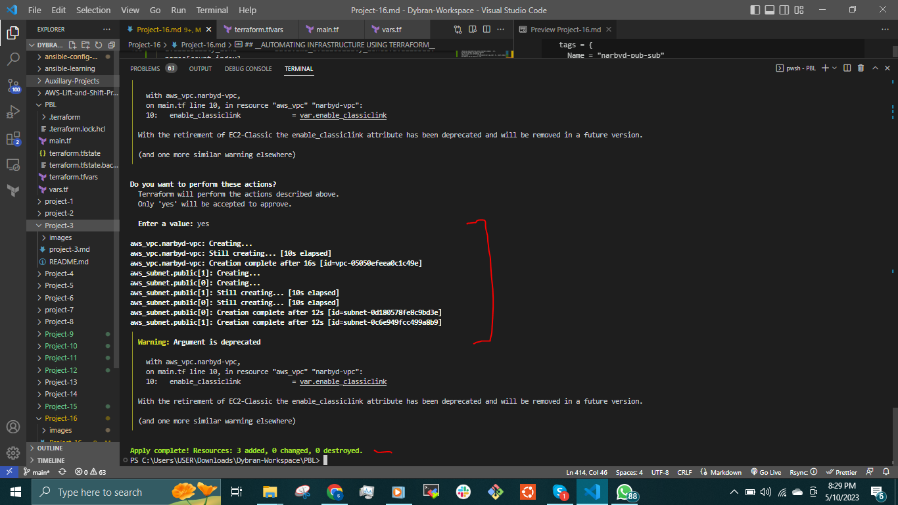

We can check if our resources have been created and tagged successfully.


We have successfully created our __VPC__ and subnets in the __region__ and __availability zones__ respectively.

Run

`$ terraform destroy` to delete the resources.

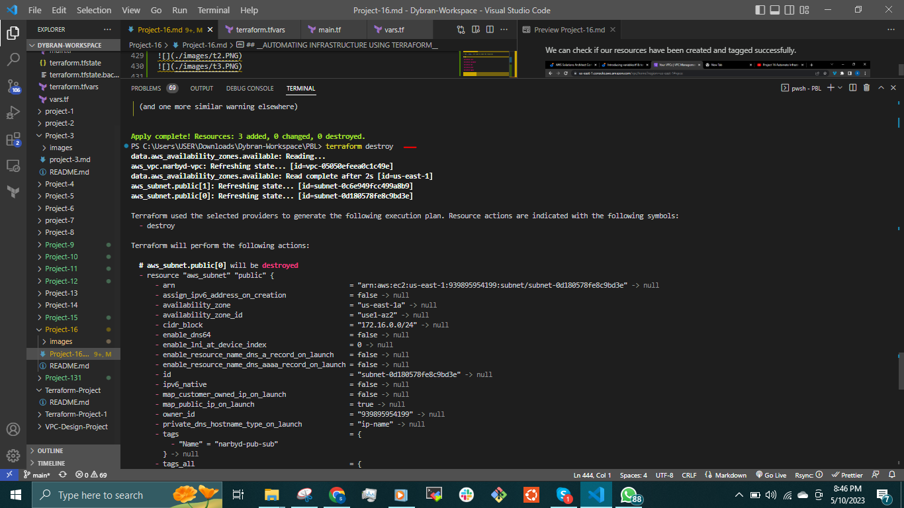
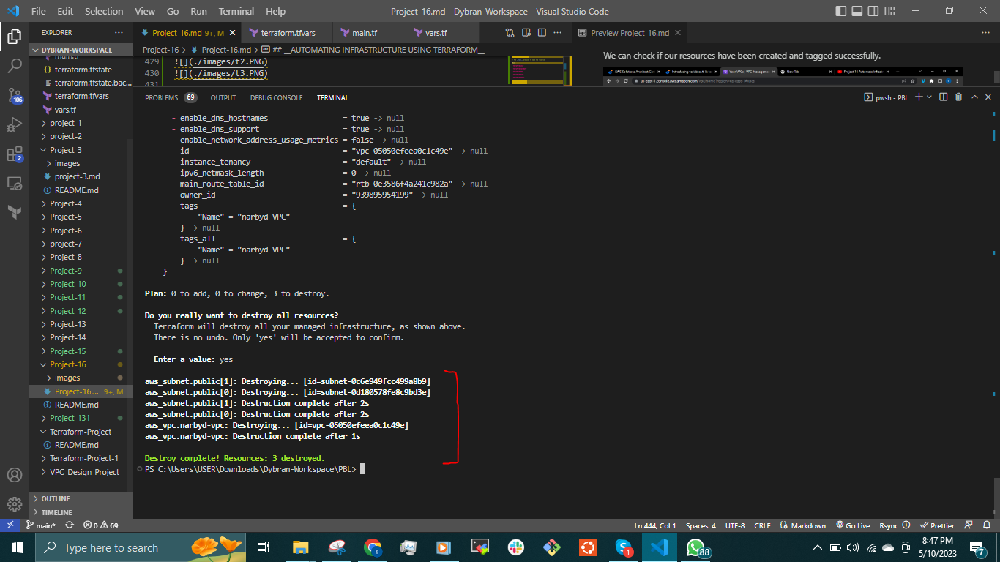

Continue the infrastructure in [Project-17](https://github.com/dybran/Project-17/blob/main/Project-17.md)
